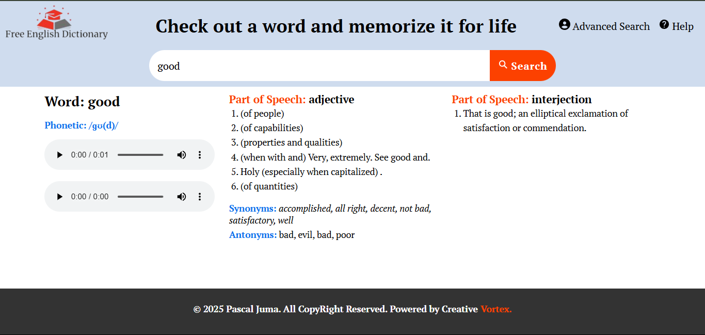

# FREE ENGLISH DICTIONARY

## 🚀 Getting Started

This is a free dictionary website built using React.js, which fetches data from a dictionary API to provide word definitions,

phonetics, and example sentences. With a simple and intuitive interface, users can quickly look up words and expand their vocabulary.

## 🛠 Features
✅ Search for any word and get instant definitions

✅ Phonetic transcriptions to improve pronunciation

✅ Audio pronunciation for accurate learning

✅ Example sentences to understand word usage

✅ Responsive design for desktop and mobile

## 📌 Prerequisites

Before running the project, ensure you have the following installed:

- Node.js (Download from nodejs.org)

- npm or yarn (Comes with Node.js)

- React.js (Installed via Vite)

## Acknowledgments
I want to express my heartfelt gratitude to Dennis Otwoma, our incredible trainer at Teach To Give, for his guidance, mentorship, 

and unwavering support throughout this project.

A huge thank you to everyone who contributed to making this project a success—from my colleagues at Teach2Give to 

the amazing community that has been part of this journey. Your encouragement, feedback, and collaboration have been invaluable.
